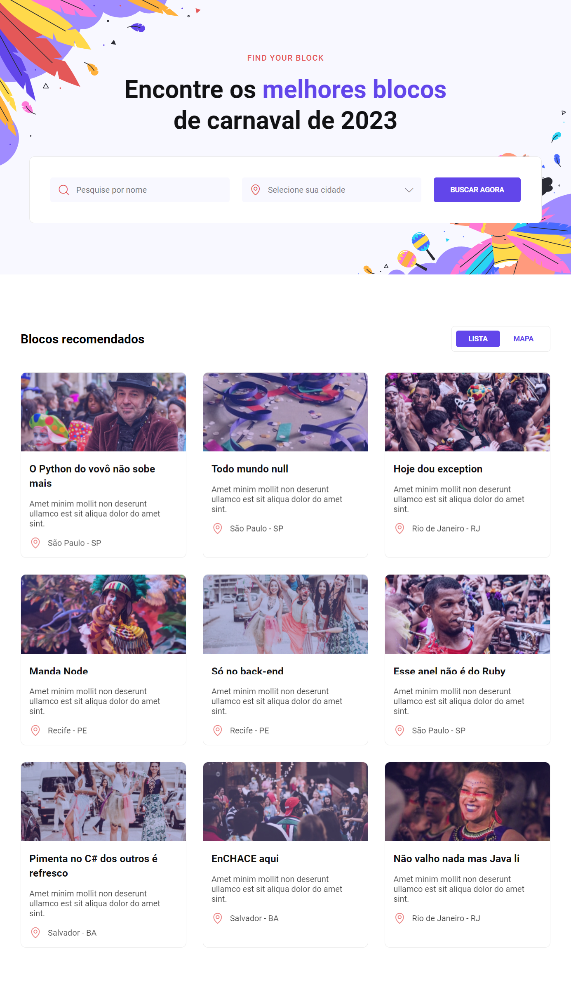

<h1 align='center'>Carnival-Website</h1>

A Website challenge of Rocketseat. In this app I am using HTML and CSS.

## Features Developed

- [x] DOM element manipulation
- [x] Responsivity

## Screenshots

The interface

 

## Prototype

You can access the Rocketseat prototype by clicking the button below.

## Technologies

## Services Used

## Deploy

You can access the project by clicking the button below.

